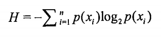

# deep learning algorithms

## 1. KNN (k-近邻算法)

### description: 

```将测试样本中的特征点与样本集中的特征点对比找出k个最近的样本的分类标签```


### formula:


计算距离:

```d = 」(Xa - Xb )2 + (Ya - Yb )2```

数据归一化(确保数据不受其实际大小影响):

```newValue = (oldValue - min) / (max-min)```

-----------------


## 2. Decision tree (决策树-ID3)

### description: 

```通过计算熵来获取信息增量，而取得局部最优的feature来划分数据集，最后通过递归来构建决策树```


### formula:


计算数据集的熵: 

p(xi)是选择该分类的概率



-----------------
